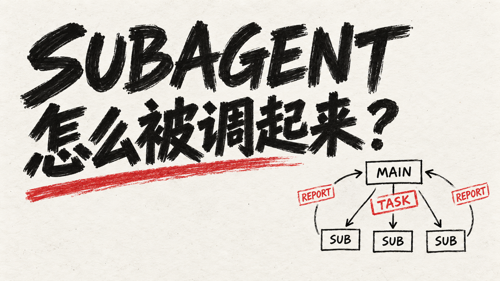
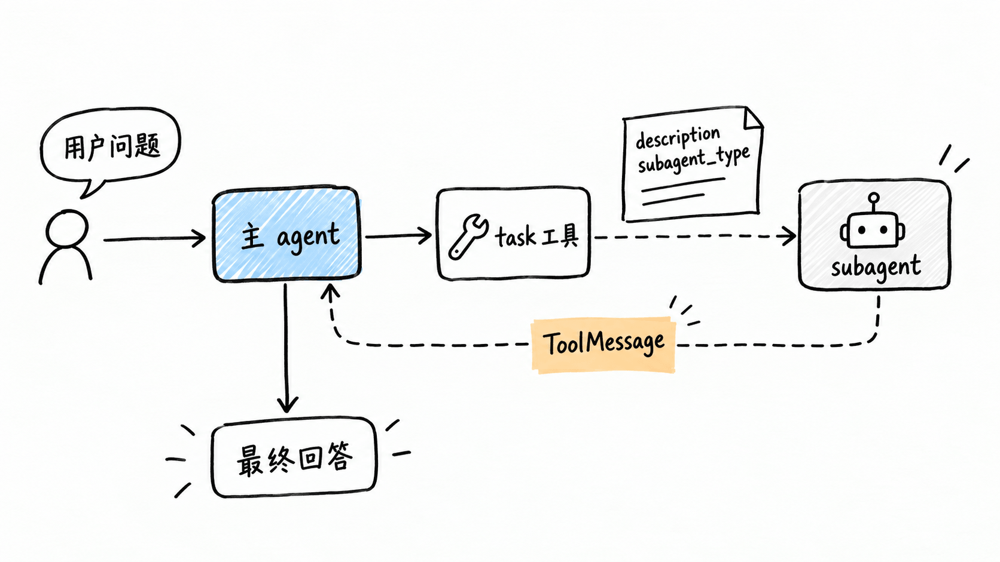
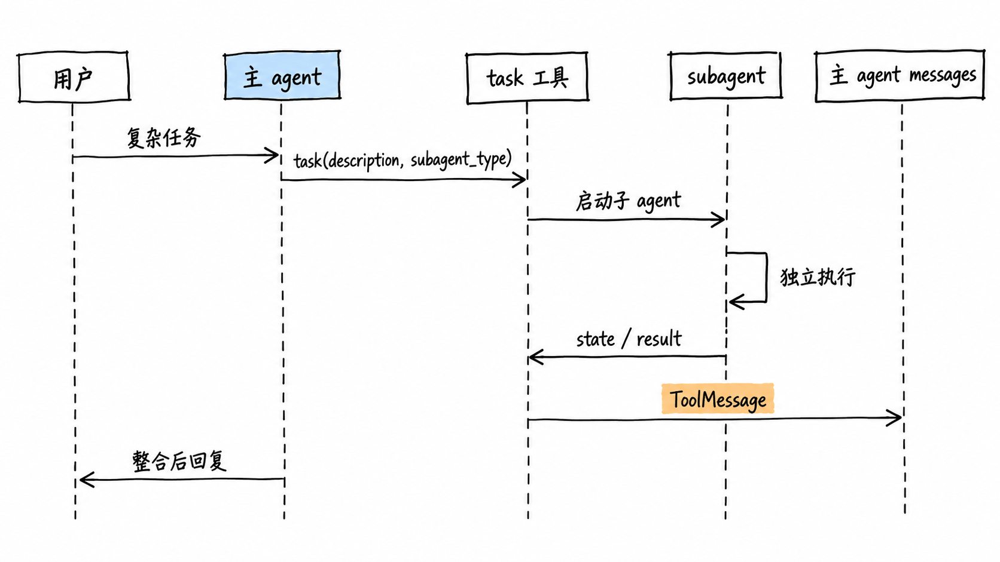
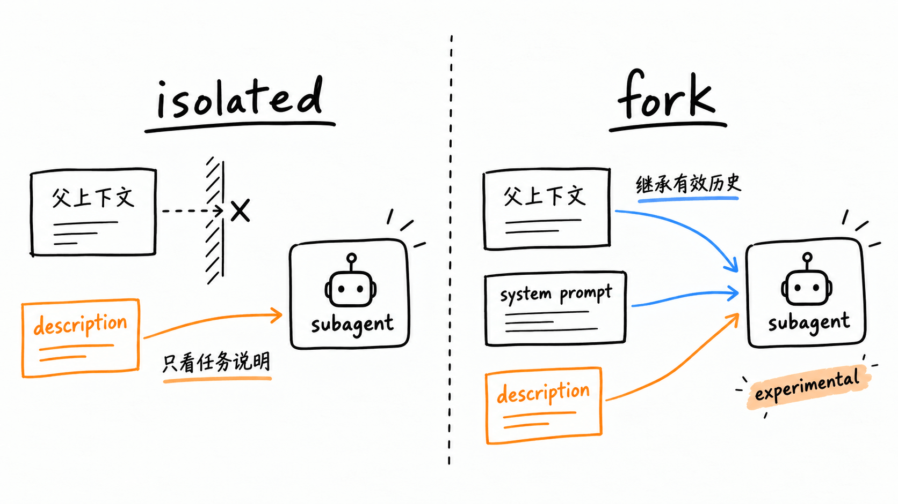
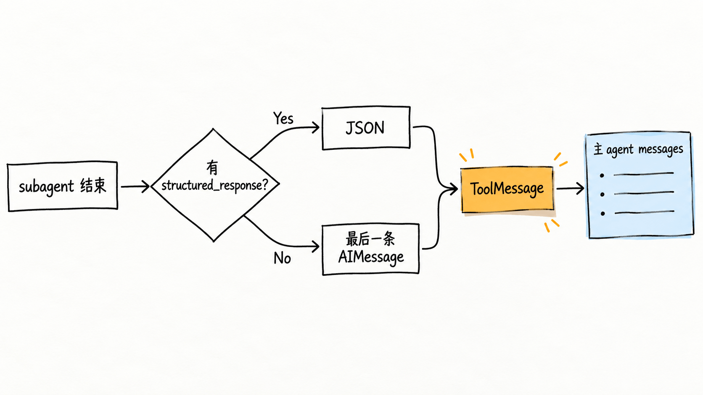
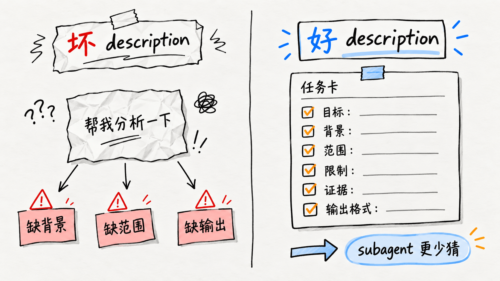

+++
title = 'Langchain DeepAgents里的subagent，到底是怎么被主agent调起来的？'
slug = "langchain-deepagents-subagent-task-invocation"
description = "主 agent 怎么调 subagent？从 task 工具原理、description 最佳实践、isolated vs fork 模式，到何时派遣子代理的完整工程指南。"
date = 2026-09-11T19:48:24+08:00
image = "images/cover-minimal-dazibao.png"
+++



刚开始看 Deep Agents 的 subagent 机制时，有点绕。很多文章讲 multi-agent，都会先讲一堆角色分工：主 agent 负责规划，子 agent 负责执行，最后再统一汇总。但几乎都没说清楚：

**主 agent 到底是怎么 “叫” subagent 干活的？**

先放一张图。后面的内容基本都围绕它展开。



这个图里最关键的一点是：

**在 Deep Agents 里，主 agent 调用 subagent，本质上是调用了一个工具。**

这个工具就叫 `task`。

## 主 agent 是怎么调用 subagent 的？

在 Deep Agents 里，`task` 工具是 `SubAgentMiddleware` 注入给主 agent 的。

主模型看到它时，和看到 `read_file`、`grep`、`search` 这些工具没有本质区别。都是模型可以选择调用的工具。只是 `task` 比较特殊，它不是去读文件，也不是去查资料，而是启动一个临时 subagent，让它去完成一段相对复杂的工作。



从主模型的视角看，它主要关心两个参数：

```python
task(
    description: str,
    subagent_type: str,
)
```

`description` 是给 subagent 的任务说明。

`subagent_type` 是选择哪一种 subagent，比如 `general-purpose`、`researcher`、`code-reviewer`。

这个说法可能不够严谨，因为工具内部实际还有框架注入的运行时参数。但对 LLM 来说，真正需要它填写和决策的，基本就是这两个东西。

所以理解 subagent 最好的切入点，就好比：


## `description` 为什么这么重要？

默认情况下，subagent 是隔离运行的。

也就是说，它不会自动看到主 agent 前面完整的对话历史。它主要看到的是主 agent 放进 `description` 里的内容。


比如你让主 agent 调一个 researcher subagent，只写：

```text
帮我分析一下这个问题。
```

那 subagent 其实是很难工作的。它不知道“这个问题”是什么，不知道用户真正想要什么，也不知道输出要偏结论、偏证据，还是偏建议。

更好的 `description` 应该写成这样(不需要我们写，但是我们得告诉主Aagnet该如何写)：

```text
请分析 Deep Agents 中 subagent 调用机制。重点说明：
1. task 工具如何暴露给主 agent；
2. description 和 subagent_type 分别起什么作用；
3. isolated 和 fork 模式的上下文差异；
4. subagent 的最终结果如何返回给主 agent。

请基于源码和测试给出结论，输出时包含关键发现、证据位置和不确定点。
```

## isolated 和 fork 的区别

Deep Agents 里的 subagent 默认是 `isolated`。

可以粗略理解成：主 agent 新开了一个干净的子任务，只把 `description` 递过去。

它的好处是干净，不容易被主 agent 的中间推理污染。坏处是：如果 `description` 写得不完整，subagent 就缺上下文。



还有一种模式是 `mode="fork"`。

fork 是从主 agent 当前状态分叉出一个执行流。它会继承父 agent 的有效对话历史和系统提示，然后再追加一条新的任务消息，告诉它：你现在就是被调用的 subagent，真正要完成的任务如下。

不过当前`fork` 在源码里是实验特性，不能完全当成稳定 API 来理解。它也有一些限制，比如 fork 模式下不能单独声明 `skills`，因为它会继承父 agent 的技能上下文。

## subagent 的结果怎么传回主Agent？

subagent 并不是直接把自己的上下文窗口并进主 agent。

如果所有 agent 共享同一个上下文，事情会很快变乱：主 agent 的推理、subagent 的工具调用、中间日志、多个方向的调查结果，全都混在一起。



subagent 执行完以后，框架会从它的返回 state 里取结果：

1. 如果有 `structured_response`，就把它 JSON 序列化；
2. 如果没有，就找最后一条非空的 `AIMessage`；
3. 然后包装成父 agent 里的 `ToolMessage`；
4. 主 agent 再基于这个 `ToolMessage` 继续推理。

最终面向用户的答案，还是主 agent 写的。主 agent 要读 subagent 的结果，要判断哪些可信、哪些重复、哪些互相冲突，然后再整合。

## 什么时候真的需要 subagent？

目前官方推荐 subagent 适合用在“主 agent 自己做会很重”的地方。

比如：

- 搜索范围很大；
- 要读很多文件；
- 需要多步调查；
- 几个方向可以并行推进；
- 需要一个专门角色，比如研究、代码审查、数据分析；
- 不想让大量中间信息污染主 agent 的上下文。

但一步就能完成的小事，其实没必要开 subagent。

比如只是问某个函数在哪里，或者改一个很小的文案。主 agent 自己做就行。硬开 subagent，反而多一层成本。


**如果派出去以后，主 agent 收到的是一份更干净、更有用的报告，那就值得。否则不用。**


## 那么如何才能用好subagent呢？

本质上是写两类提示词：
- **主 agent 的 system prompt**：负责“怎么分工、什么时候派活、怎么收结果”。
- **subagent 的 system prompt**：负责“子代理拿到任务后怎么干、干到什么程度、怎么汇报”。



**主 Agent 的提示词要满足这些点**

第一，主 agent 要知道自己是“调度者”，不是所有事情都自己做。

可以写：

```
你是主协调代理。遇到复杂、多步骤、需要搜索、需要代码审查、需要大量上下文阅读、或者可以并行拆解的任务时，优先使用 task 工具把子任务委托给合适的子代理。你负责拆分任务、选择子代理、读取子代理返回结果，并最终整合成面向用户的回答。
```

第二，要明确什么时候用 `task`。

```
当任务需要多步调查、广泛搜索、代码库探索、独立审查、信息对比、并行处理，或者需要专门能力时，使用 task 工具调用子代理。简单的一步任务不要调用子代理。
```

第三，要明确 `description` 必须写完整。

因为默认情况下，subagent 只能看到 `description`，看不到主 agent 的完整上下文。

```
调用 task 时，description 必须是完整、可独立执行的任务说明。必须包含用户目标、必要背景、任务范围、限制条件、需要查看的文件或主题、以及期望输出格式。
```

第四，要告诉主 agent 怎么选 `subagent_type`。

```
根据 task 工具描述中列出的子代理能力，选择最匹配的 subagent_type。优先选择专门子代理；只有没有合适专门子代理时，才使用 general-purpose。
```

第五，要告诉主 agent 可以并行派活。

```
如果多个子任务彼此独立，可以在同一轮中发起多个 task 调用，让它们并行执行。不要把可以并行的任务无谓地串行处理。
```

第六，要告诉主 agent：子代理结果不会直接给用户。

```
子代理返回的报告不会直接展示给用户。你必须阅读、判断、去重、处理冲突，并把结果整合成最终回答。
```

第七，要防止过度委托。

```
不要为了简单任务调用子代理。只有当子代理能明显降低上下文压力、提升质量或加速并行处理时，才使用 task。
```

**主 Agent 提示词示例**

```
你是主协调代理。

你的职责是理解用户目标、拆分复杂任务、选择合适的子代理、整合子代理返回结果，并给用户最终答案。

当任务需要多步调查、广泛搜索、代码库探索、独立审查、信息对比、并行处理，或者需要专门能力时，使用 task 工具调用子代理。简单的一步任务不要调用子代理。

调用 task 时，description 必须是完整、可独立执行的任务说明，因为大多数子代理默认只能看到 description，看不到完整对话。description 应包含：用户目标、必要背景、任务范围、限制条件、需要查看的文件或主题、以及期望输出格式。

根据 task 工具描述中列出的子代理能力，选择最匹配的 subagent_type。优先选择专门子代理；只有没有合适专门子代理时，才使用 general-purpose。

如果多个子任务彼此独立，可以在同一轮中发起多个 task 调用，让它们并行执行。

子代理返回的报告不会直接展示给用户。你必须阅读、判断、去重、处理冲突，并整合成面向用户的最终回答。
```

**Subagent 的提示词要满足这些点**

第一，明确子代理自己的角色。

比如研究子代理：

```
你是一个专注的研究子代理。你的职责是围绕主代理交给你的问题进行调查，并返回清晰、可靠、可供主代理整合的报告。
```

第二，明确它默认只能看见任务描述。

```
除非任务明确说明你继承了完整上下文，否则你只能依赖 description 中提供的信息。缺少必要信息时，请指出缺口，不要自行编造。
```

第三，明确工具使用方式。

```
在得出结论前，优先使用可用工具收集证据。代码问题优先查看源码和测试；研究问题优先查看官方文档、原始资料或可靠来源。
```

第四，明确输出格式。

```
最终报告请包含：
1. 直接结论
2. 关键发现
3. 证据或引用
4. 不确定点或风险
5. 建议下一步
```

第五，明确子代理的读者是主 agent，不是最终用户。

```
你的最终回复是给主代理看的，不是直接给用户看的。请保持简洁、完整、便于主代理整合。
```

第六，明确停止条件。

```
当你已经有足够证据完成委托任务时，就停止。不要扩展到任务范围之外。
```

第七，明确不要越权。

```
不要做任务范围之外的修改、重构、搜索或推测。除非 description 明确要求，否则不要改代码。
```

**Subagent 提示词示例：研究型**

```
你是一个专注的研究子代理。

你的职责是围绕主代理交给你的问题进行调查，并返回清晰、可靠、可供主代理整合的报告。

除非任务明确说明你继承了完整上下文，否则你只能依赖 description 中提供的信息。缺少必要信息时，请指出缺口，不要自行编造。

在得出结论前，优先使用可用工具收集证据。优先使用官方文档、源码、测试、原始资料或可靠来源。不要只凭记忆回答。

最终报告请包含：
1. 直接结论
2. 关键发现
3. 证据或引用
4. 不确定点或风险
5. 建议下一步

你的最终回复是给主代理看的，不是直接给用户看的。请保持简洁、完整、便于主代理整合。

当你已经有足够证据完成委托任务时，就停止。不要扩展到任务范围之外。
```


